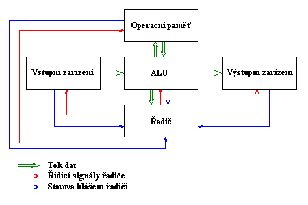
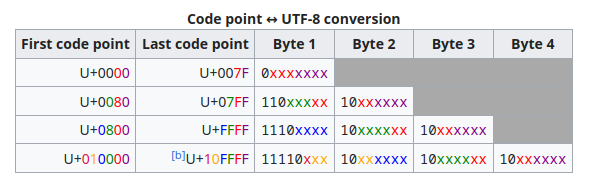

# 1. Základní pojmy informatiky

***Obsah otázky:*** Základní pojmy informatiky (bit, byte, adresář, soubor, HW, SW, atp.), ukládání dat (číselné soustavy, převody  mezi nimi), architektura počítače (Von Neumannova architektura, Harvardská architektura). Kódování základních  datových typů, binární doplněk, IEEE 754

## Základní pojmy informatiky
- informatika není přesně definovaná disciplína, ale volně řečeno se informatika zabývá přenosem a zpracováním informace
- zkoumá počítačové návrhy (designy), programování, zpracovávání informací, algoritmické (sada kroků, které definují provedení úkolu) řešení problémů a vlastní algoritmické procesy

### Vysvětli pojmy: bit, byte; vysvětli rozdíl mezi MiB a MB
- **bit** je základní a zároveň **nejmenší jednotkou dat**, značí se malým písmenem *b*, nabývá 2 hodnot a to 1 a 0 - pravda a nepravda - ano, ne
- **byte** je 8 bitů, značí se velkým B, používá se jako základní jednotka kapacity počítačové paměti a objemu dat, byte označuje nejmenší objem dat, se kterým dokáže počítač najednou pracovat
    - pojem zavedl v 50. letech 19. století informatik z IBM Werner Bushholz a pochází ze slova bite - sousto

### Vysvětli pojmy soubor a adresář/složka
- **soubor** je nějaká množina dat se společnými vlastnostmi, je pojmenován a uložen na disku, lze s ním pracovat nástroji operačního systému jako s jedním celkem
- **adresář** sdružuje na disku dokumenty (soubory) a další složky (podadresáře) a slouží k tomu, aby si je uživatel mohl logicky uspořádat

### Co to je operační systém, co zajišťuje
- **operační systém** je software, který řídí chod počítače, kontroluje rozhraní mezi strojem a vnějším světem, chrání počítač a data v něm uložená před neoprávněným přístupem, umožňuje uživateli spouštět různé programy, koordinuje interní funkce
    - Na počítači může běžet pouze jeden program - operační systém je zodpovědný za spouštění ostatních procesů

## Ukládání dat
### Číselné soustavy
- číselná soustava - způsob zapsání číslice
    - každá má určitý počet číslic (znaků)
- **dvojková** (binární) - zápis jedniček a nul
- **šestnáctková** (hexadecimální) - zápis číslic 0-9 a písmen a-f (16 znaků)
    - dvě hexadecimální číslice umí vyjádřit jeden byte (byte je 0-255, 16 * 16 možností = 256)
    - tím značně zjednodušuje zápis bytů (místo 8 číslic zapisujeme 2)
- **osmičková** (oktálová) - zápis číslic 0-7
    - tři bity
    - použití např. v Unixu pro oprávnění k souboru
- **desítková** (dekadická) - zápis číslic 0-9, používaná v běžném životě 

### Převody mezi soustavami
- převod do soustavy:
  1. vydělíme celočíselně číslo počtem znaků v soustavě
  2. zbytek je číslo, které zapíšeme (začínáme od konce!)
  3. pokračujeme 1. krokem s výsledkem celočíselného dělení
    - např. převod čísla 400 do hexadecimální soustavy:  
        1. `400 // 16` je 25, zbytek je 0. -> `0x__0`
        2. `25 // 16` je 1, zbytek je 9. -> `0x_90`
        3. `1 // 16` je 0, zbytek je 1. -> `0x190`
        4. Výsledkem je `0x190`
- převod ze soustavy:
  1. vezmeme číslici a vynásobíme ji počtem znaků v soustavě umocněným na pozici (začínáme od nuly)
  2. tohle uděláme pro všechny číslice a výsledek sečteme
    - např. převod čísla `0x190` z hexadecimální soustavy:
        1. `0 * 16**0` = 0
        2. `9 * 16**1` = 144
        3. `1 * 16**2` = 256
        4. 0 + 144 + 256 = 400

## Architektura počítače
### Von Neumannova architektura počítače
- navržena roku 1945 Johnem von Neumannem, s jistými výjimkami je zachována dodnes
- **operační paměť** slouží k uchování zpracovávaného programu, zpracovávaných dat a výsledků výpočtu
- **ALU (arithmetic-logic unit)** (aritmetickologická jednotka) provádí veškeré aritmetické výpočty a logické operace. Obsahuje sčítačky, násobičky (pro aritmetické výpočty) a komparátory (pro porovnávání)
- **řadič** je řídící jednotka, která řídí činnost všech částí počítače. Toto řízení je prováděno pomocí *řídících signálů*, které jsou zasílány jednotlivým modulům. Reakce na řídící signály, stavy jednotlivých modulů jsou naopak zasílany zpět řadiči pomocí *stavových hlášení*
    - **vstupní zařízení**: zařízení určená pro vstup programu a dat.
    - **výstupní zařízení**: zařízení určená pro výstup výsledků, které program zpracoval

  

### Harvardská architektura
- **Harvardská architetura** byla navržena v 30. letech 20. století při vývoji počítače HARVARD MARK 1 
- má na rozdíl od von Neumanovy architektury oddělený paměťový prostor pro data a pro program
    - paměť je rozdělena na paměť programu a dvě paměti dat tak, aby současně mohly dva operandy vstupovat do ALU
- součin dvou operandů v jednom instrukčním cyklu provede hardwarová násobička a výsledek součinu je přičten k akumulátoru (operace typu MAC - Multiply And Accumulate),
- je zvýšen počet samostatných datových a adresových sběrnic a přímý přístup do paměti je prováděn vícenásobným kanálem DMA (Direct Memory Access),
- řízení jádra procesoru je odděleno od řízení vstupních a výstupních jednotek a architektura typu 1X a 2X znamená, že jedna instrukce je provedena v jednom nebo ve dvou hodinových cyklech (taktech).
  

## Kódování známých datových typů
- informace v počítačích jsou zakódovány jako posloupnosti *bitů* (zkrácení slova *binary digit*)

### Kódování textu
- **ASCII** - první kódování designované pro angličtinu, prvně používané v USA
    - používá 7 bitů pro každý znak
    - navrženo pro ruční překlad; např pro ascii `0b10_____` lze převést posledních 5 číslic do dekadické soustavy a výsledek odpovídá pozici čísla v abecedě (1 = A, 26 = Z)
    - obsahuje řídící znaky (line feed = nový řádek, NULL = konec stringu...)
    - lze rozšířit o dalších 128 znaků tím, že přidáme osmý bit - regionální kódování
- **UTF-8** - dnes nejpoužívanější
    - kódování, které je schopné podporovat takřka všechny jazyky a zápisové systémy 
    - rozložení znaků definuje *norma Unicode* a *konsorcium Unicode* 
    - *variable length* - ne všechny znaky jsou stejně dlouhé, používá 1 až 4 byty na znak
    - pokud je osmý bit 1, přečte se víc bytů 

  
    - 1 byte - původních 128 znaků v ASCII (zpětná kompatibilita - ASCII text lze proto otevřít jako UTF-8)
    - 2 byty - varianty latinky vč. české, další abecedy (řecká, cyrilice, hebrejská, arabská...) 
    - 3 byty - ostatní znaky základní roviny Unicode vč. běžných východoasijských znaků
    - 4 byty - ostatní roviny Unicode: méně používané znaky, emoji

### Kódování záporných čísel (binární doplněk)
- číslo s nejvyšším indexem se odečítá od zbytku
- např. `0b0000` = 0, `0b0111` = 7, `0b1000` = -8, `0b1111` = 7 - 8 = -1

## Kódování desetinných čísel/floatů (standard IEEE 754)
- standard definuje formáty pro reprezentaci čísel v pohyblivé desetinné čárce

| bit    | 31              | 30 29 ... 24 23   | 22 21 ... 3 2 1 0 |
| ------ | --------------- | ----------------- | ----------------- |
| význam | sign (znaménko) | exponent (8 bitů) | mantisa (23 bitů) |

| bit    | 31   | 30  | 29  | ... | 24  | 23  | 22  | 21  | ... | 3   | 2   | 1   | 0   |
| ------ | ---- | --- | --- | --- | --- | --- | --- | --- | --- | --- | --- | --- | --- |
| význam | sign | e7  | e6  | ... | e1  | e0  | m1  | m2  | ... | m20 | m21 | m22 | m23 |

- pro převod: (-1) ^ s * 2 ^ (E - 127) * (1 + Q)
    - E = exponent
    - odečítá se 2 ^ (exp-1) - 1, kde exp je počet bitů v exponentu
    - Q = m1 * 2^−1 + m2 * 2^−2 + … + m22 * 2^−22 + m23 * 2^−23
- také definuje formáty pro zvláštní případy:
    - záporná nula
    - denormalizovaná čísla
    - kladné a záporné nekonečno
    - *Not a Number* 

| podmínka              | hodnota                            | popis                                         |
| --------------------- | ---------------------------------- | --------------------------------------------- |
| E = 1 až 254          | X = (-1)^s * 2 ^ (E-127) * (1 + Q) | základní formát                               |
| E = 0, Q ≠ 0          | X = (-1)^s * 2 ^ −126 * Q          | denormalizovaná čísla                         |
| E = 0, Q = 0, s = 0   | X = 0                              | kladná nula                                   |
| E = 0, Q = 0, s = 1   | X = 0                              | záporná nula                                  |
| E = 255, Q = 0, s = 0 | X = +∞                             | kladné nekonečno (výsledek byl příliš vysoký) |
| E = 255, Q = 0, s = 1 | X = −∞                             | záporné nekonečno (výsledek byl příliš nízký) |
| E = 255, Q > 0        | X = NaN                            | není číslo                                    |