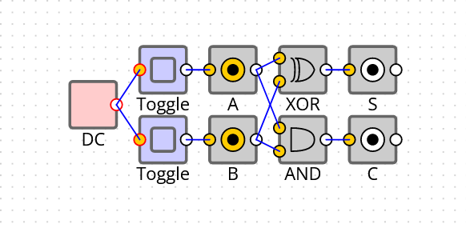
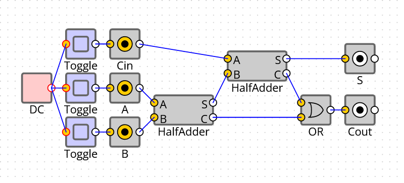

# 2. Vývoj PC

***Obsah otázky:*** historie počítačů a spínací prvky hradel; binární sčítačka; počítačová architektura, druhy počítačů

## Turing Completeness
- Turing complete = označení počítače, programovací jazyka apod. který může emulovat Turingův stroj
- Turingův stroj:
    - Teoretický stroj vymyšlený matematikem Alanem Turingem
    - zařízení, které dokáže simulovat jakýkoliv algoritmus, spočítat vše spočítatelné
    - nejjednodušší stroj na řešení algoritmů, velmi jednoduché kroky
    - moderní počítače fungují na stejný princip
    - zrodil se zde také koncept *programů*, které byly *uloženy v paměti* (x nebyly připojeny někde bokem)

## Dějiny počítačů

### Předchůdci
- Abakus (počítadlo)
- Logaritmická pravítka
- Mechanické sčítačky a odčítačky (např. Pascalina pro výpočet daní)
- 1833 - Charles Babbage vyvinul "Analytický stroj" (Analytical engine) - první programovatelný stroj pomocí **děrných štítků**
    - Babbage si najal matematičku **Adu Lovelace**, která pro něj programovala

### 0. generace 
- počítače s **reléovými** obvody (elektromagnetický spínač)
- 30. a 40. léta 20. století
- počítače Z1 (první!), Z2, Z3,  Harvard Mark I., II., český SAPO (Samočinný Počítač)
- hodně spínačů -> prostorově náročné

### 1. generace 
- počítače s **elektonkovými** obvody (vede proud ve vakuu)
- polovina 40. let - 50. léta
- počítač ENIAC - první počítač podobný těm dnešním, **Turing Complete**
- nebyly o moc menší, ale spánaly rychleji - několik set až 1000 operací za sekundu
- velká poruchovost (životnost elektronek), nespolehlivé, elektronicky náročné

### 2. generace 
- počítače s **tranzistorovými** obvody (polovodičová elektronika; používá se dodnes)
- druhá polovina 50. let - polovina 60. let
- počítače UNIVAC, EPOS
- počítače pronikají mimo vědu a univerzity
- objevují se první programovací jazyky: COBOL, FORTRAN
- menší a méně energeticky náročné spínače, mnohem větší výkon

### 3. generace 
- počítače s **integrovanými** obvody
- polovina 60. let - 70. léta
- počítače IBM, Siemens 4004
- rychlost řádově roste a počítače se zmenšují
- první podpora pro **multitasking**
- vznikají první mikropočítače, minipočítače (integrují se jen tranzistory)

### 4. generace 
- počítače s **mikroprocesory** - integruje celý obvod (cache, řadič, ALU, ...)
- od konce 70. let, vyvíjí se stále
- počítače se opět zmenšují a vznikají **osobní počítače**
- ikonický procesor **x86** - většina dalších používala jeho architekturu (Intel atd.)
- vs. procesory **ARM** - odlišná architektura, nejpoužívanější u mobilů a tabletů - nižší spotřeba
- grafická rozhraní

### 5. generace
- zatím jen **teoretické** modely 
- kvantový počítač
- biologické počítače / biopočítače - používají molekuly (např. DNA a proteiny) pro výpočty
- fotonové počítače - využívají fotony pro výpočty; rychlejší než elektrony

## Hradla

### Binární logika
- 1702, *G. W. Leibniz* - vymyslel systém, skládající se z řady nul a jedniček popisující nějaký problém; věřil, že život může být zjednodušen na řadu jednoduchých problémů
- 1854 navázal *George Bool* s **Boolean algebrou** (true/false) - AND, OR, NOT, NOR, XOR, NAND (lze z něj složit ostatní hradla)
- de Morganovy zákony:
    - Negace součinu `not (A and B)` = Součet negací `(not A) or (not B)`
    - Negace součtu `not (A or B)` = Součin negací `(not A) and (not B)`

### Binární sčítačka
- když počítáme pod sebe - často si "držíme jedničku" - to samé funguje i v sčítačce
- sečtení dvou binárních číslic - dva výstupy: součet a carry

#### Poloviční sčítačka
- sčítá bez ohledu na předchozí carry
- `A xor B` - součet, `A and B` - carry

| A   | B   | C = `(A and B)` | S = `(A xor B)` |
| --- | --- | --------------- | --------------- |
| 0   | 0   | 0               | 0               |
| 0   | 1   | 0               | 1               |
| 1   | 0   | 0               | 1               |
| 1   | 1   | 1               | 0               |

#### Úplná sčítačka
- sčítá i s předchozím carry
- jednou sečteme A a B, podruhé sečteme předchozí carry a carry ze součtu A a B, a poté ORneme carry z obou součtů

