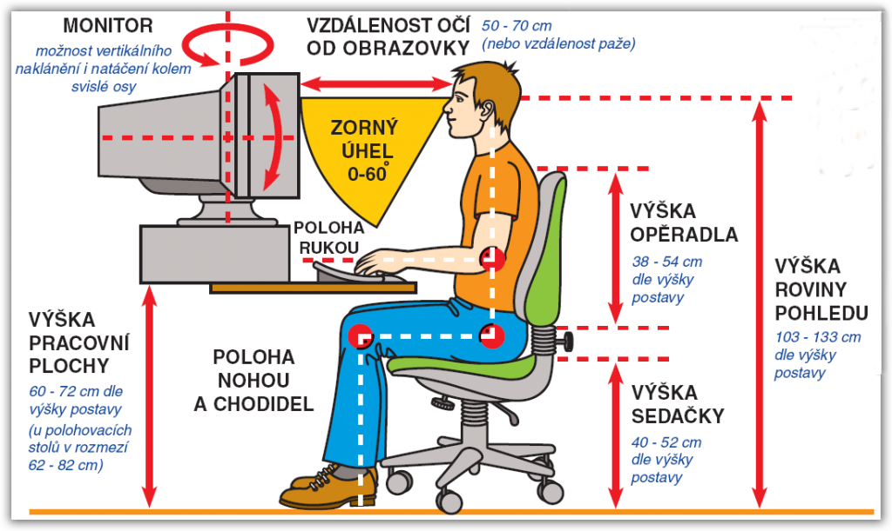

# 3. Operační systémy

***Obsah otázky:*** rozdělení, základy práce s operačním systém MS Windows (základní nastavení pracovní plochy, vzhledu a základního chování); aktualizace systému, ovládací panely, nástroje pro správu, správa uživatelských účtů. Ergonomie práce s PC. 

## Operační systém
- **Operační systém** je základní program počítače, který umožňuje běh programů a komunikaci s hardwarem
- Interakce s uživatelem:
    - **GUI** (Graphical User Interface) - umožňuje uživateli ovládat počítač pomocí tlačítek, oken, ikon, atd.; nyní se dá ovládat i pomocí dotyku a hlasu
    - **CLI** (Command Line Interface) - zpracovává příkazy ve formě textu
- Filesystem/systém souborů 
    - používá se pro ukládání dat na disk, je to specifický způsob, ve kterém jsou data ukládána a umožňuje např. pojmenovávat soubory či stromovou strukturu
    - dříve OS podporovaly jen 1 typ souborového systému, dnes OS jako Unix nebo Linux podporují tzv. virtual file system (VFS) = abstraktní vrstva nad souborovými systémy, umožňuje přístup k různým typům souborových systémů
    - většina OS má svůj vlastní souborový systém
        - Windows - NTFS (jednoduchá organizace, velké objemy dat)
        - Linux - ext/ext4 (nekompatibilní s Win a MacOS)
        - macOS - HFS+, APFS
        - **FAT** (FAT32) - starý souborový systém, ale **kompatibilní se všemi OS**
    - metadata nad souborem - název, datum změny/vytvoření, vlastník souboru...
    - funkce modernách FS:
        - **Žurnálování​** - "deník" operací, který počítač vede při práci s diskem, při crashi z něj může obnovit 
        - **Oprávnění k souborům**​ - metadata s přístupovými právy, na Unixu 3 * 3 bitů (user, group, other)
        - Komprese​
        - Šifrování​
        - Symbolické odkazy

## Rozdělení operačních systémů
Podle typu zařízení:
- desktop (PC) - cílem je jednoduchost, univerzálnost, práce s mnoha aplikacemi - např. Microsoft Windows, MacOS, distribuce GNU/Linux
- mobilní zařízení - cílem snadnost obsluhy, úspora energie, univerzálnost - např. Android, iOS
- servery - cílem je vysoký výpočetní výkon, snadná údržba, bezpečnost - např. Linux a Windows NT
- real-time OS - cílem je co nejrychlejší reakce, použití v automobilech, VR - např. pSOS, Linux-RT

Podle počtu současně běžích programů:
- single-tasking - může běžet pouze jeden program, zabírá méně paměti (MS-DOS, Palm-OS)
- multi-tasking - může běžet více programů současně (Windows, MacOS)

Podle počtu uživatelů:
- jednouživatelský OS - nijak nerozlišuje uživatele
- víceuživatelský OS - umožňuje zpracovávat požadavky více uživatelů

## Práce v operačním systému Microsoft Windows
- Popiš pracovní prostředí systému, používej správnou terminologii
    - plocha, ikony, lišta, nabídka Start...
- Popiš možnosti nastavení vzhledu systému (zaměř se na vlastnosti pracovní plochy, vzhled nabídky aplikací v moderních systémech či nabídky Start)
    - right click na ploše --> přizpůsobit
- Ukaž aktualizaci systému (pomocí grafického rozhraní)
    - nastavení --> Windows update
- Ukaž správu uživatelských účtů, vytvoř uživatele, nastav mu práva, vytvoř heslo (poté uživatele vymaž)
    - lupička --> uživatel --> přidat uživatele
- Správa počítače - ukaž rozdělení disků, případně přidělení jiného písmena disku např. flash disku
- Práce s příkazovým řádkem, příkazy cd, mkdir, rmdir, dir
- Nastavení sítě, vysvětli rozdíl mezi statickou IP adresou a adresou přidělovanou z DHCP*
    - **statická adresa** - nemění se, často se používá jako bezpečnostní prvek (VPN), běžně se za ní připlácí
    - **dynamická adresa** - mění se
- Práce s programem "Průzkumník souborů", pohyb v adresářové struktuře, vytváření složek, kopírování souborů
- Vytvoř adresář, ukaž na něm nastavení přístupových práv pro jednotlivé uživatele

## Erogonomie práce s PC
Ergonomické a zdravotní zásady práce u počítače:
- časté pauzy
- protahování
- standing-desk

