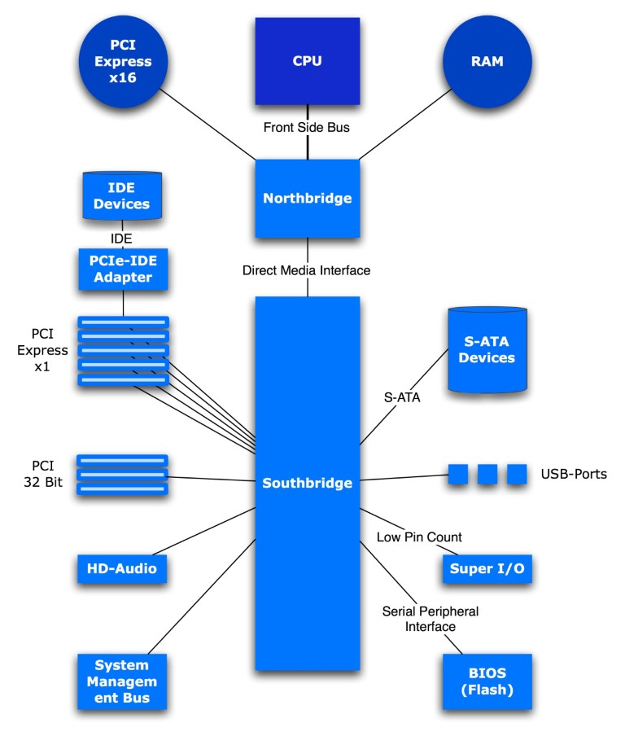
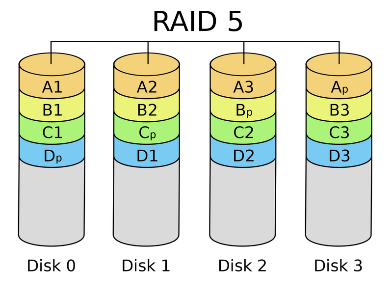

# 7. HW počítače

***Obsah otázky:*** složení PC a základní parametry jednotlivých komponent; periferní zařízení počítače (tiskárny, monitory, scannery); periferie. 

## Počítač
- **počítač** = zařízení měnící vstupní data na výstupní; ukládá a zpracovává data pomocí programů
- **PC** = personal computer, počítač určený pro 1 uživatel, přenosný
	- *server* = počítač, který poskytuje informace dalším počítačům (klientům), nabízí služby (webovky atd.)
- **jednočipový PC** = integrovaný obvod obsahující kompletní mikropočítač, používaný např. v automobilových motorech, ovladačích, hračkách atd. (internet of things)

### Rozdělení podle rozměru a výkonu
- **superpočítače**
	- nyní nejrychlejší počítače, velmi drahé, prostorově náročné
	- specializované na co nejrychlejší zpracování velkího množství dat
	- využívány pro vědecké simulace, animace, výzkum nukleární energie
- **mainframe**
	- podobný superpočítači
	- podporuje mnoho uživatelů současně, provádí velké množství operací/programů současně
	- využívány pro komerční společnosti - banky, výzkumná centra, ...
- **minipočítače**
	- středně velký počítač, může ho používat až 200 uživatelů současně
	- využívány pro databáze, automatizaci, výplaty atd.
	- dnes se už skoro nepoužívá
- **mikropočítače**
	- malý počítač s microprocesorem, dnes už je počítač
	- např. PC, laptop, mobily, server atd.

### Rozdělení podle využití
- **pro kancelářskou práci** - desktop PC (výkonnější PC na např. animace a grafiku)
- **pro přenos** - mobil, tablet, notebook
- **pro hry** - herní PC, konzole
- **pro poskytování služeb** - servery

## Interní komponenty

### Základní deska
- propojuje všechny komponenty (CPU, RAM, GPU) dohromady
- **CMOS baterie** - Úložný prostor pro konfiguraci v BIOSu, datum a čas
- **rozšiřující sloty** - umožňuje připojení periferií (=zařízení)
	- vkládají se do nich karty (např. síťová, zvuková, grafická) - nyní běžně integrováno
- **chipset** - skupina malých obvodů, koordinuje pohyb dat mezi hlavnámi komponenty PC
	- **severní most (north bridge)** = spojuje CPU s RAM
	- **jižní most (south bridge)** - komunikuje se perifériemi
	
- **konektory** - propojují komponenty s ZD
	- *interní* - za běhu počítače s nimi nemanipulujeme
		- IDE - pro připojení pevných disků
		- SATA - vychází z IDE, ale dosahuje vyšších rychlostí a je menší
	- *externí*
		- VGA - analogový kabel pro připojení monitoru (přenáší obraz)
		- HDMI - digitální kabel pro připojení monitoru (přenáší obraz i zvuk)
		- Ethernet - kroutí se, aby se znegovalo magnetické pole, které vytváří
		- USB (Universal Serial Bus) - starší 2.X (přenáší větší proud), novější 3.X (rychlejší přenos dat) 

### Procesor
- zpracovává samotné výpočty (instrukce)
- jednojádrové - nejstarší, mohou provádět jen 1 operaci najednou, velmi pomalé
- vícejádrové - rychlejší CPU clock, zvládá multitasking
- vždy podporuje jen jednu instrukční sadu ("architekturu"), programy nepřenositelné (proto vznikly kompilované jazyky)
	- x86-64 / amd64 - nejčastější v stolních počítačích, 64bitový
	- i386 / IA-32 - stará 32bitová architektura, amd64 je s ním zpětně kompatibilní
	- ARM - nízká spotřeba energie, použití v mobilních zařízeních a v nových počítačích Mac
- výrobci:
	- Intel
	- AMD
- části procesoru:
	- **řídicí jednotka (řadič)** - zajišťuje součinnost jednotlivých částí procesoru, posílá data skrz systém
	- **logická jednotka (ALU)** - provádí nad daty aritmetické a logické operace
	- **registry** - malé množství vysokorychlostní paměti, skládající se zde data potřebná pro procesy, např. výsledky výpočtů, používané instrukce, ...
	- **mezipaměť (cache)** - vyrovnávací paměť procesoru
	- **procesorové hodiny** - synchronizují operace PC

### Paměť
- vnitřní paměť počítače
- **RAM** - paměť, v níž jsou uloženy běžící programy (včetně operačního systému) a jejich data
- **mezipaměť (cache)** - uchovává data a tím následující přístup k těmto datům může být rychlejší
- **ROM** - Read-Only Media, dnes se už skoro nepoužívá

### Úložiště (pevné disky)
- **HDD** - fyzický disk, z něhož jsou data čteny pomocí mechanického ramene (levnější, spolehlivější, pomalejší)
- **SSD** - neobsahuje pohyblivé části, rychlejší, ale rychle degradují
- **Flash drive** - snadno přenosné, praktické pro malé soubory
- **Optické disky** - Blu-ray > DVD > CD - čtení data laserem
- **Floppy disk (disketa)** - jeden z prvních úložných prostorů, velmi malá velikost
- kapacita = velikost úložiště, měřená v bajtech (MB, GB a TB)
- počet otáček - měří rychlost, čím více otáček, tím větší rychlost 
- přístupová doba - měří, jak dlouho trvá načtení 1. znaku

#### RAID
- Redundant array of independent disks
- Chrání před ztrátou dat
- Často používán na serverech, ale nic nebrání používat na domácím počítači
- **RAID 0** - rozložení bloků dat na více disků
- **RAID 1** - zrcadlení disku (dva disky obsahují stejná data, při poškození lze ten druhý zkopírovat)
- **RAID 5** - paritní blok na každém z disků, umožňuje zpětně spočítat celý obsah při výpadku jednoho z disků

- **RAID 7** - dva paritní bloky...

### Grafická karta
- vytváří grafický výstup na monitoru
- optimalizované pro grafické výpočty, obsahují mnoho velmi primitivních jader
- díky schopnosti rychle počítat s tenzory v dnešní době také využívány pro trénování modelů AI
- může být integrována do základní desky
- výrobci: Nvidia, AMD, Intel

### Chlazení
- zabraňuje přehrátí
- vzduchem, kapalinou

## Externí komponenty

### Tiskárny
- **Jehličkové** – Dřív nejvíc rozšířený typ tiskáren
	- Nízká cena, ale nízká kvalita tisku
	- Je schopna tisknout několik vrstev najednou
	- Je hlučná a pomalá
	- Princip: elektromagnetická hlava, kdy jehličky přenášejí pomocí elektromagnetu barvu z pásky na papír (průměr jehličky 0,2-0,3)
- **Inkoustové** – Momentálně nejvíc používané
	- Kvalita, u těch nejlepších srovnatelně s laserovou
	- Občas se tisk rozmaže
	- Pomalá rychlost
	- Vysoká cena náplní
		- Není způsobenou cenou inkoustu, ale obchodní strategií výrobců (prodat levně tiskárnu, draze prodat inkoust)
	- Princip: Tisková hlavice – patrony s inkoustem a hlava na přenos barvy. Napěťový puls 3-5 mikrosekund ohřeje odpor na 400 stupňů. Inkoust je pod tlakem vypuzen a obrázek pak složen s teček s vysokou hustotou.
- **Laserové** – Nejkvalitnější způsob tisku
	- Vysoká cena tiskárny i toneru
	- Princip: Základem je selenový válec nabitý statickým nábojem. Otáčí se a je na něj vypálen laserem obraz- (obalen práškovou barvou). Při další otáčce barva přenášena na papír, zažehlena válci – elektrografický proces.

### Skener
- skenuje dokument do digitální podoby
- může být součástí tiskárny
- program, který skenuje, může převést digitální obraz zpět do upravitelných znaků pomocí tzv. OCR (Optical Character Recognition)

### Monitor
- **CRT**
	- zobrazovací zařízení, které funguje na principu katodové trubice (typ urychlovače elektronů) se stínítkem.
		- trubice je uzavřena do vakuové baňky, obraz je vytvořen pomocí tří svazků urychlených elektronů, jeden pro každou barvu spektra
		- svazky elektronů jsou vychylovány elektromagnetickými silami pomocí cívek
		- elektrony dopadají na stínítko pokryté luminoforem.
	- Nevýhody: Hloubka, spotřeba, vyzařování 
	- Výhody: Komfortnější úhel, ostrost, doba odezvy, cena
	- Parametry: velikost, rozlišení, poměr stran, obnovovací frekvence (snímků za sekundu - většinou 60Hz)
	- Připojení k počítači: Pomocí VGA 
- **LCD**
	- zobrazovací panel, který funguje na principu tekutých krystalů
		- Tekutý krystal je látka, která dokáže setrvat jak v kapalném a pevném skupenství, tak vytvořit krystalickou strukturu, v závislosti na elektrickém náboji
		- krystaly jsou vloženy mezi průhledné elektrody a polarizační filtry a elektrickým nábojem je řízeno natočení těchto krystalů
		- díky tomu dochází k řízení průchodu a polarizaci světla
		- obraz zobrazován v bodech (pixelech) tvořených subpixely (red, green, blue) jejichž kombinací lze zobrazit různé barvy
	- Nevýhody: delší doba odezvy, horší úhly, horší zobrazení černé
	- Výhody: cena, jas
	- Parametry: velikost, rozlišení, obnovovací frekvence
	- Připojení k počítači: HDMI
- **LED**
	- zobratovací panel, který funguje na základě diod LED
		- postaveno na principu aditivního sčítání barev, kdy každý jednotlivý plně barevný bod obrazovky tvoří trojice LED – červená, zelená a modrá
		- při sledování velkoplošné LED obrazovky z určité vzdálenosti barevný svit všech tří LED splyne díky omezené rozlišovací schopnosti lidského oka a pozorovatel ho vnímá jako jeden barevný bod
	-  Nevýhody: cena, úhly, přesvětlení
	-  Výhody: dobře viditelné na přímém slunci,  menší spotřeba, dobrý kontrast
	-  Parametry: velikost, rozlišení, obnovovací frekvence
	-  Připojení k počítači: HDMI