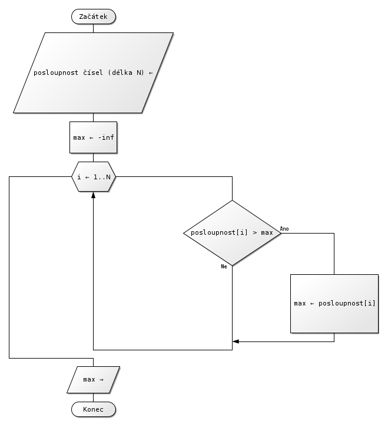

# 8. Algoritmizace

***Obsah otázky:*** algoritmus a jeho vlastnosti, zápis algoritmu, základní programové konstrukce (podmínky, cykly), příklady užitečných algoritmů v informatice

## Definice algoritmu
**Algoritmus** je přesný návod či schematický postup pro řešení určitého typu úloh, který je prováděn pomocí konečného množství přesně definovaných kroků. Jinými slovy – algoritmus je jednoznačný a přesný popis řešení problému. 

Ačkoliv se dnes tento pojem používá především v informatice a přírodních vědách obecně, tak je jeho působnost daleko širší (kuchyňské recepty, návody a postupy...). Samotné slovo algoritmus pochází ze jména perského matematika 9. století Abu Jafar Muhammada ibn Mūsā al-Chwārizmího, který ve svých dílech položil základy algebry (arabské číslice, řešení lineárních a kvadratických rovnic).

## Základní vlastnosti algoritmů
- *Rezultativnost.* - po konečném počtu kroků dospěje k řešení/výsledku (vrátí třeba jen chybové hlášení)
-  *Konečnost* - algoritmus se nezacyklí, po určitém počtu kroků skončí
- *Elementárnost (jednoduchost) popisu.* - algoritmus je popsán konečným počtem základních instrukcí. Tedy takových, o kterých je jasné, jak se provedou (a tedy neumožňují žádný osobitý výklad některého vykonavatele).
- *Determinovanost (jednoznačnost).* - v každém kroku je jednoznačně určen způsob pokračování práce algoritmu
- *Obecnost* - algoritmus řeší všechny úlohy daného typu / úlohy jisté třídy.
- *Koreknost* - algoritmus produkuje pro každý správný vstup korektní výsledek.

## Možnosti zápisu algoritmů, příklady
- *grafické vyjádření* (přehledný, ale špatně se opravujou chyby, jenom jednodušší algoritmy)
	- **Vývojový diagram**  
	
  
	- **Strukturogram** (něco mezi textovým a grafickým)  
	
        
- *slovní vyjádření* (těžce se čte, ale jednoduše se upravuje a je ideální na psaní složitějších problémů)
	- **Přirozený jazyk** - jednotlivé kroky postupu jsou vyjádřeny větami v přirozeném jazyce 
  	- **Strukturovaný jazyk** - přirozený jazyk s určitými omezujícímy pravidly, pro počítače existují programovací jazyky
  		- **Programovací jazyk** - určen k zápisů algoritmů pro provední počítečem, má klíčová slova s jednoznačným významem
   		- **Pseudokód** - jazyk připomínající bežné programovací jazyky; vyhýbá se implementačnı́m detailům a konkrétnı́m standardům opravdových jazyků, zároveň je však tak přesný, aby šel jednoduše převést do vhodného programovacı́ho jazyka
- **Matematické vyjádření** algoritmus popíšeme jednoznačnou matematickou konstrukcí (např. rovnicí nebo konstrukčním popisem geometrické úlohy)
     

## Značky pro zápis vývojových diagramů

## Vypracované vývojové diagramy pro algoritmy z otázky 

- Výpočet kořenů kvadratické rovnice

- Výběr největšího čísla ze zadané posloupnosti čísel

## Příklady užitečných algoritmů v informatice
- **třídící algoritmy** - existuje jich řada a jsou naprosto stěžejní, používané pro řazení prvků podle nějakého pořadí 
- **Euklidův algoritmus** - nalezne největšího společného dělitele dvou čísel
- **binární vyhledávání** - rychle vyhledá prvek seřazeného pole
- **hashovací algoritmy** - vytvoří hash ze vstupu - unikátní hodnotu, ze které nelze zpětně nalézt vstup. Využití pro kryptografii nebo pro datový typ *slovník*.
