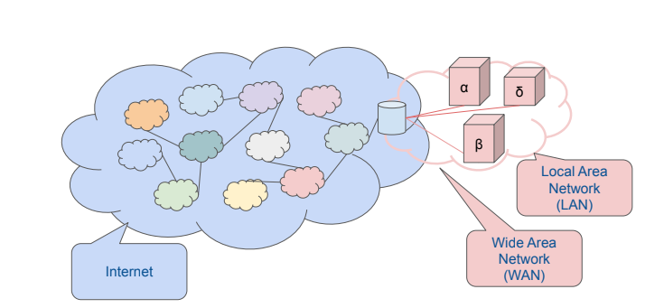
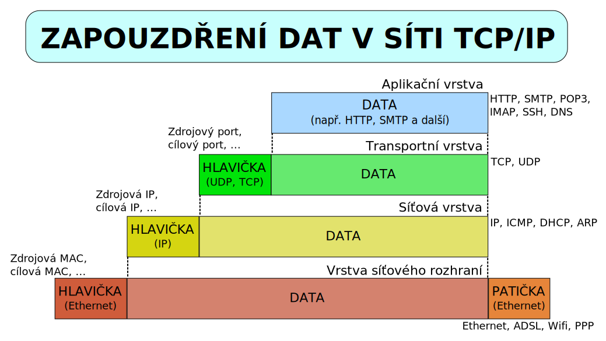

# 13. Internet

***Obsah otázky:*** Princip činnosti, TCP/IP, služby a historie internetu, práce s www prohlížečem, vyhledávání informací na internetu (katalogy a vyhledávače). Ochrana autorských práv a osobních údajů.  

**Internet** = celosvětový systém **navzájem propojených počítačových sítí**

## Historie
- **60. léta** - myšlenka *decentralizované* a *robustní* sítě -  v USA za **Studené války**
    - finanční prostředky - grantová agentura ministerstva obrany USA **(D)ARPA** (Defense Advanced Research Projects Agency) 
    - podle této agentury byla síť pojmenována jako **ARPANET**
- **konec 60. let** - první uzly této síťě byly umístěny vetšinou na **vyspělých univerzitách**
    - paketový přenos dat (tok dat je rozdělen na menší části - pakety)
- **70. léta** - vznik protokolu **TCP/IP**
    - vyvíjeli Vint Cerf a Bob Kahn
    - řeší pouze vysílání a provoz mezi uzly; zbytek řeší koncový uzel sám
    - vzniká IP verze 4 - označení počítače v síti čtyřmi 8bitovými čísly
    - 80\. léta - ARPANET přechází z protokolu NCP na TCP/IP 
- vzniká **DNS** *(Domain Name System)* - přiřazuje IP adrese nějaký název - doménu
- v této době se zmenšují počítače a dostávají se do bank, velkých korporátních firem, ale i do obchodů
- 1989 - vzniká **WWW** *(World Wide Web)* - nahrazuje ARPANET, je označení pro systém prohlížení, ukládání a odkazování dokumentů nacházejících se v internetu
- 1998 - vzniká Windows 98 a internet se dostává do mainstreamu

## TCP/IP
- odvozen od ISO/OSI (7 vrstev)
- internet potřebuje protokoly TCP/IP k tomu, aby komunikace (výměna dat) probíhala bez chyb a mezi správnými počítači
- je to rodina protokolů - obsahuje sadu protokolů pro komunikaci v počítačové síti

### Vrstva síťového rozhraní
- přístup k fyzickému přenosovému médiu
- Wifi, Ethernet...
- MAC adresa = fyzická (skutečná) adresa, přiřazena při výrobě

### Síťová vrstva
- v operačním systému, bezpečně doručit data mezi nepřímo spojenými počítači (IP adresa); souvisí s tím směrování (cesta internetem)
- IP adresa = logická adresa (na úrovni síťové vrstvy)
    - Doménová adresa = textová adresa, rozřešena pomocí protokolu DNS do IP adresy

### Transportní vrstva
- také v OS, (zajišťuje transport velkých dat) zajistit přenos dat tak, aby tam nenastala chyba (manipulace + kontrola)

### Aplikační vrstva
- zajišťuje samotná aplikace, komunikace dvou zařízení; používají se tzv. protokoly, např. HTTP

## Ochrana autorských práv a osobních údajů
- obsah často pod **Licencí** - stanovuje, co s obsahem smíme a nesmíme konat
- časté požadavky:
    - požadavek zmínění autora při použití
    - omezení komerčního použití
    - omezení derivativní práce (GNU GPL vyžaduje, aby deriváty práce pod GPL byly taktéž pod GPL)

### Druhy SW licencí
- **Open Source Software** - Program poskytovaný i se zdrojovým kódem zdarma.
- **End User Licence Agreement** – EULA – jeden z nejčastějších druhů licenčního ujednání. Jistě to znáte, jedná se o ten dlouhý text, co nikdy nikdo nečte. Měli byste. 
- **Volné dílo** (public domain) - Zde nejsou majetková autorská práva nikterak chráněna. 
- **Freeware** - Software s používáním zdarma. Autor si nenárokuje žádnou odměnu a můžete používat funkce zdarma.