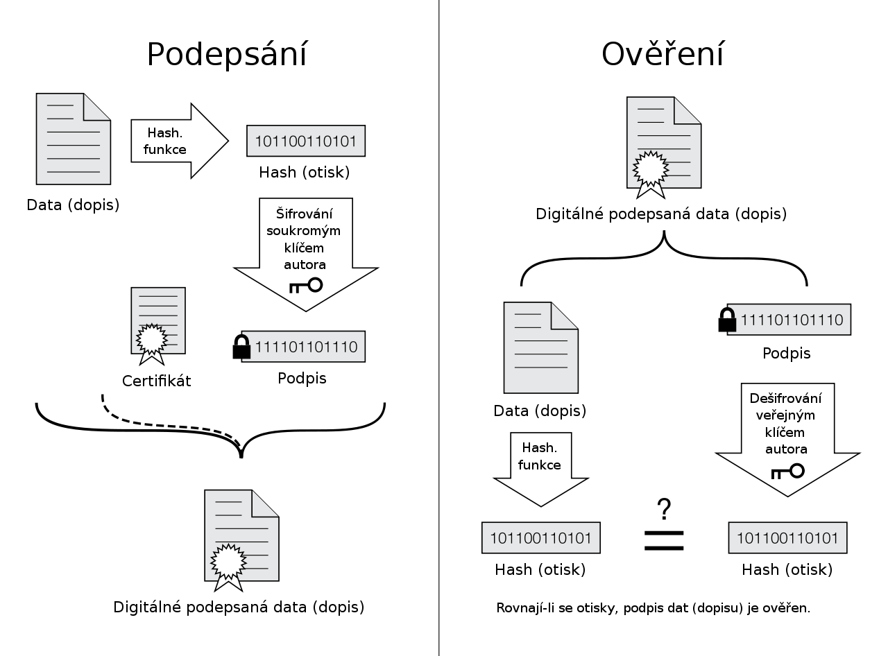

# 14. Bezpečné digitální prostředí

***Obsah otázky:*** digitální identita a její vazby s fyzickou identitou – datová schránka, elektronický podpis, token; neověřená a falešná digitální identita; nevědomá digitální stopa – logy, metadata, cookies, sledování uživatele a narušení soukromí při využívání internetu; vědomá digitální stopa – virtuální osobnosti a jejich cílené vytváření; fungování a algoritmy sociálních sítí

## Digitální identita a její použití
- digitální identitou rozumíme data uložená na počítači, která reprezentují jednotlivce nebo organizaci na internetu
- tvořena různými informacemi: jméno, e-mailová adresa, telefonní číslo apod
- tři způsoby potvrzení totožnosti:
    - něco, co víme (heslo)
    - něco, kým jsme (otisk prstu)
    - něco, co vlastníme (bezpečnostní token)
        - = fyzické nebo virtuální zařízení, které potvrzuje identitu
        - např. 2FA aplikace v mobilu, fyzický USB token
- **datová schránka**: online úložiště pro komunikaci a výměnu dokumentů mezi jednotlivci a úřady
- **elektronický podpis**: umožňuje ověřit identitu odesílatele a ochránit dokument proti úpravě či padělání
    
    - veřejný x soukromý klíč - princip jednosměrných operací. Veřejný klíč slouží jen pro ověření a lze ho volně šířit, soukromý klíč si schováváme pro sebe a vytváříme jím data, která ověřuje veřejný klíč 
    - Příklady takového softwaru - GnuPG
-  **falešná digitální identita** - není potvrzena nebo ověřena, může být úmyslně používána k anonymním nebo nelegálním aktivitám

## Digitální stopa
- informace zanechaná uživatelem na internetu
- není mozné ji úplně odstranit

### Vědomá (aktivní) digitální stopa
- založený účet na sociální síti - vytváříme virtuální osobnost (youtube kanál, účet na facebooku, blog na tumblru)

### Nevědomá (pasivní) digitální stopa
- zanechány na internetu i bez našeho záměru
- např. sledování uživatele pomocí trackovacích cookies
    - first-party cookies: sledují uživatele v rámci jedné stránky; např. pro automatické přihlášení
    - third-party cookies: sledují uživatele napříc celým webem
        - problém např. s online reklamou - reklamní banner je `<iframe>` na web Googlu, který podle svých vlastních cookies monitoruje, které stránky navštěvujeme
    - jak se tomu vyhnout:
        - header Do Not Track: doslova webu říkáme "moc moc prosím nesleduj mě! UwU"
        - rozšíření do prohlížeče, které cookies blokuje
        - prohlížet v anonymním režimu

## **Fungování a algoritmy sociálních sítí
- sociální sítě používají složité algoritmy k analýze chování uživatelů a prezentaci obsahu na základě jejich zájmů, preferencí a chování online
- je tím proslulý např. TikTok, Instagram, Facebook 
- klíčové funkce algoritmů sociálních sítí:
    - **Personalizace obsahu:** Algoritmy se snaží zobrazit uživatelům obsah, který je pro ně relevantní a zajímavý
    - **Zvýrazňování virálního obsahu:** Algoritmy identifikují obsah, který má potenciál stát se virálním nebo získat vysokou míru zapojení uživatelů, a preferují jeho zobrazení v feedu
    - **Filtrování nevhodného obsahu:** Algoritmy mohou filtrovat obsah, který porušuje stanovené pravidla komunity nebo obsahuje nevhodný materiál, jako je hate speech, NSFW apod.
    - **Maximalizace zapojení uživatelů:** Algoritmy se snaží udržet uživatele co nejdéle na platformě tím, že jim zobrazují obsah, který mají největší šanci považovat za zajímavý a interaktivní
