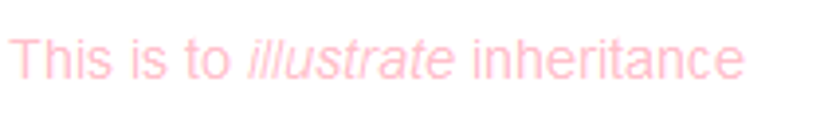

# 15. Internetové technologie

***Obsah otázky:*** Pojmy Internet, WWW, doména, webhosting, cloud. Zápis kódu webových stránek, HTML (struktura, základní značky), CSS (využití při tvorbě webových stránek, nástroje v prohlížečích). Jazyky interpretované na straně prohlížeče, jazyky interpretované na straně serveru.

## Pojmy
- **internet** - globální počítačová síť skládající se z propojených sítí používajících TCP/IP protokol, poskytuje informace a možnosti ke komunikaci
- **www** - world wide web; informační systém dostupný přes internet původně založený na konceptu vzájemně propojených dokumentů HTML
- **doména** - slovní označení IP adresy počítače (aby si uživatelé nemuseli pamatovat číselnou IP), které jsou pomocí DNS (Domain Name Server) rozřešeny zpět do IP adres
	- českou top-level domain .cz spravuje sdružení **CZ.NIC**
	- **registrátor domén** - společnost, které registruje/rezervuje domény, musí být akreditována registrátorem TLD (.org, .net. .com, ...) nebo registrátorem národních domén (.cz, .us, .uk, ...)
		- u nás okolov 50, např. **Forpsi**, **Wedos**, mají smlouvu s CZ.NIC
- **webhosting** - pronájem prostoru pro webové stránky na cizím serveru -> uživatel nemusí mít vlastní
- **cloud** - servery dostupné přes internet + software a databáze na nich, skladuje data

## Kód webových stránek
- 3 jazyky: HTML, CSS a JavaScript

### HTML
- HyperText Markup Language
- Značkovací jazyk definující strukturu webové stránky
- Vzhledově podobný XML, ale HTML nelze označit jako nadstavbu XML!
	- V HTML můžeme použít neuzavřené tagy
- Prázdný HTML dokument dle editoru Visual Studio Code:
```html
<!DOCTYPE html>
<html lang="en">
	<head>
		<meta charset="UTF-8">
		<meta name="viewport" content="width=device-width, initial-scale=1.0">
		<title>Název dokumentu</title>
	</head>
	<body>
		
	</body>
</html>
```
- Některé tagy:
```html
<h1>Hlavní nadpis</h1>
<h2>Nadpis nižší úrovně</h2>
<p>odstavec</p>
<b>tučný text</b>
<i>kurzíva</i>
<br> break (zalomení)
<a href="https://google.com">odkaz</a>
```
- Současným standardem je HTML 5
	- Sémantické významy tagů: Doporučuje se nahradit např. `<b>` tagem `<strong>` pro vyjádření důrazu při čtení (např. čtečkou pro slepé)

### CSS
- definuje grafickou podobu stránky (barvy, font, rozložení, ...)
```css
body {
	background-color: white;
	color: black;
	padding: 10px;
}
```
- *kaskádující* - jednotlivé styly se vzájemně dědí a přepisují
```css
p {
	color: pink;
}
```

```html
<p>
	This is to <em>illustrate</em> inheritance
</p>
```



### JavaScript
- Programovací jazyk interpretovaný na straně prohlížeče
- Dodává webu interaktivitu, funkcionalitu
- Úzká integrace s HTML a CSS (přístup přes Document Object Model; DOM)
	- DOM - transformuje HTML strukturu dokumentu do objektů v JavaScriptu
	- např. `document.querySelector("em").innerText = "Ahoj světe";` 
- Podpora asynchronního programování, událostmi řízeného programování, které je pro web a webový prohlížeč žádoucí

## Webový server
- Program, který umí přijímat a odpovídat na HTTP požadavky
- Hlavní použití: poslání webových souborů přes internet
- **staticky renderovaný web** - "hloupě" čte a posílá předem napsané soubory HTML uložené na disku
- **dynamicky renderovaný web** - generuje HTML "za pochodu"
	- často používáme framework, pro každý jazyk jich existuje mnoho
	- Python: Django, Flask
	- JavaScript: Angular, Next.JS
	- Ruby: Ruby on Rails
	- PHP - celý jazyk PHP je navrhnut pro použití na webu
- nejpoužívanější webový server: **nginx**
	- Buď čte soubory přímo z disku, nebo může HTTP požadavek předat jinému serveru a jeho odpověď předat zpět (*proxy*)
	- Můžeme mít víc serverů, a pokud jeden neodpoví včas, může nginx předat server jinému (*load balancing*)

## Postup při tvorbě webu
- nápad --> doména + webhosting --> připravit stránku, např. pomocí WordPress nebo HTML + CSS --> údržba