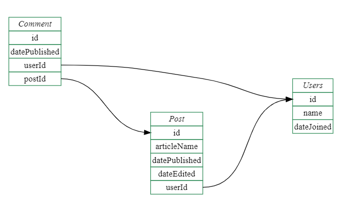

# 17. Databázové systémy

***Obsah otázky:*** Základní pojmy (databáze, pole, záznam), založení nové databáze, datové typy, základy SQL – práce s tabulkou, vyhledávání a řazení dat, dotazy, návaznost na programovací jazyky. 

## Historie
- předchůdcem byly papírové kartotéky - operace s nimi prováděl člověk fyzicky
- poté pomáhaly se zpracováním dat stroje - děrné štítky a elektromechanické počítače
- v roce 1960 vznikla první verze jazyku pro práci s databázemi **COBOL**
- začaly vznikat první **síťové** SŘBD (systém řízení báze dat = rozhraní mezi aplikačními programy a uloženými daty) na sálových počítačích
- prvním průkopníkem databází byl *Charles Bachman*
- v roce 1971 vydal výbor **Database Task Group** (DBTG - měl za úkol vytvořit koncepci databázových systémů) zprávu *The DBTG April 1971 Report*, kde se objevily pojmy jako **schéma databáze**, **jazyk pro definici schématu**, **subschéma** a podobně, byla zde popsána celá architektura síťového databázového systému
- 1970 *Edgar F. Codda* první **relační databáze**, které pohlížejí na data jako na tabulky
- 1974 se vyvíjí první verze dotazovacího jazyka **SQL** (Structured Query Language)
- v 90. letech 20. století - **objektově** orientované databáze
- vznikla **objektově-relační** technologie

## Základní pojmy
- **tabulka** - obsahuje samotná data
- **sloupec** (pole) - pole v tabulce, které má nějaký datový typ (integer, float, string (varchar), bool...)
- **databáze** - obsahuje více tabulek
- **systém řízení báze dat** (SŘBD; z angl. Database Management System - DBMS)
	- zařizuje ukládání dat a interakci s aplikacemi
	- správa klíčů, indexování
	- integrita dat, udržování unikátnosti
	- správa transakcí (napíšeme příkazy a až poté je "commitneme")
	- správa přístupu
	- příklady:
		- SQLite (bez serveru; celá databáze je jeden soubor)
		- PostgreSQL (rozsáhlé funkce, objektový model)
		- Microsoft SQL Server
		- MySQL
	- Používá je **každá** aplikace, která nějak pracuje s daty! (Bakaláři, sociální sítě...)
- **primární klíč** (primary key, PK) - hodnota nebo více hodnot, které jednoznačně určují nějaký řádek v databázi (automaticky přiřazené ID, rodné číslo...)
- **cizí klíč** (foreign key, FK) - sloupec v tabulce, který odkazuje na řádku v jiné tabulce



## SQL
- **Structured Query Language** - jazyk, pomocí kterého získáváme a zapisujeme data
- Deklarativní jazyk: zapisujeme výsledek, ne kroky, jak se k němu dostat 
- Je standardizovaný, ale různé SŘBD ho rozšiřují a upravují, aby vyhovoval jejím funkcím - příkaz napsaný pro jeden SŘBD nemusí plně fungovat v jiném

### SQL - Založení tabulky
```sql
CREATE TABLE kontakt (
	id INTEGER PRIMARY KEY AUTOINCREMENT,
	jmeno TEXT NOT NULL,
	prijmeni TEXT NOT NULL,
	telefon TEXT,
	ulice CHAR(80),
	mesto CHAR(80)
);
```

### SQL - Vyhledávání
```sql
SELECT jmeno, prijmeni, telefon from kontakt WHERE id = 3; -- přímo podle ID
SELECT jmeno, prijmeni, telefon from kontakt WHERE jmeno = 'Daniel'; -- Jméno je Daniel
SELECT jmeno, prijmeni, telefon from kontakt WHERE jmeno LIKE 'd%'; -- Začíná na D
```

### SQL - Řazení
```sql
SELECT jmeno, prijmeni, telefon from kontakt ORDER BY jmeno ASC; -- Abecedně podle jména
```

### SQLite - speciální příkazy
- SQLite obsahuje příkazy začínající tečkou - ty jsou speciální a ovládají sezení v terminálu

Otevření souboru:
```SQL
.open DATABAZE.DB
```

Úprava výpisu do terminálu:
```SQL
.headers on  
.mode column  
.width 20 20 20
```

Příkazy pro orientaci:
```SQL
.tables -- seznam tabulek
.schema -- zobrazí schéma, kterým byla DB vytvořena
.exit
```

## Návaznost na programovací jazyky
- SQL příkazy můžeme generovat a spouštět i v programovacím jazyce
	- Pokud však do příkazu přidáváme data, je NUTNÉ je tzv. escapovat, tedy upravit vstupní hodnotu tak, aby nekolidovala se syntaxí SQL
	- pokud např. v `SELECT * from kontakt where jmeno = '$JMENO'` chceme nahradit $JMENO jménem z programu, a text neescapujeme, uživatel by mohl vyhledat `Jmeno'; DROP TABLE jmeno; --`, příkaz SELECT ukončit předčasně a spustit vlastní kód
- Obvlášť oblíbený způsob, jak interagovat se SŘBD, je pomocí ORM (Object-Relational Mapper), který často mapuje objekty v programovacím jazyce k SQL příkazům a programátor tak SQL často vůbec nemusí psát

Příklad ORM v Pythonu (knihovna peewee, netřeba znát jménem)
```py
db = SqliteDatabase('my_database.db')

class BaseModel(Model):
    class Meta:
        database = db

class User(BaseModel):
    username = CharField(unique=True)

class Tweet(BaseModel):
    user = ForeignKeyField(User, backref='tweets')
    message = TextField()
    created_date = DateTimeField(default=datetime.datetime.now)
    is_published = BooleanField(default=True)

db.connect()
db.create_tables([User, Tweet])
User.get(User.username == 'charlie')
```

### Logika propojování objektů
- v ORM můžeme definovat vztahy (relace) mezi objekty, které jsou poté převedeny do logiky primárních a cizích klíčů
- vztahy mezi tabulkami:
	- **One to One** - jeden FK odkazuje na jeden PK
	- **One to Many** - více FK se odkazuje na jeden PK (jeden uživatel má několik přátel na facebooku)
	- **Many to One** - více FK se odkazuje na jeden PK (několik webových stránek má jednoho majitele)
	- **Many to Many** - více FK na více PK (několik videí má několik hashtagů)