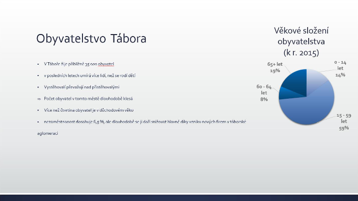
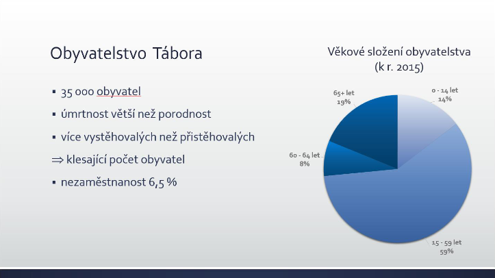

# 18. Prezentační software

***Obsah otázky:*** Popis pracovního prostředí programu Microsoft Powerpoint, tvorba snímků, animace, šablony, přechody snímků, nastavení akcí. Základy mluveného projevu při prezentování.

## Prezentační software
- počítačový program, který umožňuje vytvořit prezentaci, tj. sérii stránek neboli snímků s přehledně zobrazenými informacemi
- příklady:
    - Microsoft PowerPoint (Windows/Mac)
    - Apple Keynote (Mac)
    - Google Prezentace (web, mobilní telefony)
    - LibreOffice Impress (Linux)
- co všechno můžeme do prezentace vložit:
    - nadpis, text v odrážkách
    - obrázky
    - video (soubor či YouTube)
    - animace mezi snímky
    - animace prvků na snímku

## Práce v PowerPointu
- rozhraní:
    - vlevo - seznam snímků
    - uprostřed - samotný snímek 
    - nahoře - nástroje pro úpravu snímku
- přidání snímku - pravým kliknutím vpravo na seznam, můžeme vybrat z mnoha layoutů (úvodní snímek, konečný snímek...)
- animace - zvolíme myší objekt a v záložce animace přidáme animace - buď vstupní (objekt není vidět a zobrazí se), zvýrazňující, nebo závěrečné (objekt zmizí)
    - v podoknu animací pak můžeme volně upravovat sled animací a např. zkombinovat víc animací do jednoho kroku
- přechody snímků - můžeme vybrat z mnoha animací
    - tlačítkem použít na vše ji učiníme výchozí
- šablona - výběr motivu pro prezentaci
    - pro promítanou prezentaci je vhodný kontrastní motiv
- v záložce vložení -> akce lze přidat akci při kliknutí (audio, přejít na jiný snímek...)

## Prezentování
- před napsáním prezentace se zamyslet: co je cílem? jaký rozsah pokryji? kolik na to mám času?
- na úvod přehled toho, co se dozvíme; cíl prezentace
- na závěr poděkování za pozornost, uvedení zdrojů 
- snímky musí logicky navazovat a jít od jednoduché informace ke komplexnější
- pro přehlednost se můžeme řídit pravidlem "5x5" - 5 řádků, 5 slov na každém z nich
- používáme velké, bezpatkové písmo, kurzívu a tučný text pro zvýraznění
- při prezentování nesmíme číst snímky, ale prezentaci doplňovat. publikum by mělo poslouchat, ne číst
- pokud prezentující cítí, že diváci ztrácejí pozornost, může při prezentování stisknout klávesu B a skrýt tak dočasně obsah prezentace - publikum si všimne, že se něco děje
- špatná prezentace:  

- dobrá prezentace:  
