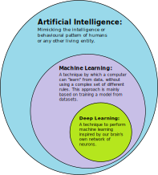

# 19. Moderní trendy v IT

***Obsah otázky:*** Mobilní technologie (GSM, mobilní sítě, mobilní zařízení), virtualizace, Cloud Computing,  IoT (Internet of Things), kryptoměny, umělá inteligence (AI) a její využití v současných technologiích. Průmysl 4.0.

## Mobilní technologie

### Systém komunikace GSM
- = **Global System for Mobile Communications**
- mobilní telefon - koncové zařízení pro většinu služeb sítě
- základová stanice (**BTS**, Base Transceiver Station) - umožňuje bezdrátovou komunikaci mezi uživatelským vybavením (mobily, ...) a mobilní sítí, může mít nástroje pro šifrování
    - systém základových stanic - BTS vytvářejí síť buněk tak, aby pokryly radiovými vlnami celé území
- síťový spojovací subsystém - zajišťuje spojování telefonních hovorů
- **HLR** (Home Location Register) - databáze domovský registr, obsahuje detaily o všech uživatelích sítě
    - při připojení v zahraničí zahájen tzv. *roaming*, kdy operátor uživatele připojí i když nepatří do jeho sítě
- **SIM** (Subscriber Identity Module) - slouží k identifikaci uživatele v síti, obsahují jednoznačné identifikační kódy, telefonní číslo, uložený telefonní seznam a uložené SMS.
- **LTE** (Long-Term Evolution) - technologie k bezdrátové komunikaci typu 4G, vylepšená 3G (10x rychlejší načítání, spolehlivé, ...)
    - dnes pomalu navazuje **5G**, které slibuje až 20 Gbit/s a milisekundovou odezvu

## Virtualizace, cloud computing
- služby nabízející pronájem silného cloudového virtuálního počítače
- nejrozšířenější: **Amazon AWS** (Amazon Web Services)
- Google Colaboratory - zdarma
- často "vendor lock-in" - data z jedné služby nelze jednoduše převést na druhou, aby si první služba udržela svého zákazníka

## IoT (Internet of Things)
- **IoT** - označení pro síť fyzických zařízení (vozidel, domácích spotřebičů, termostat, ...) vybavených elektronikou, softwarem či senzorem, které umožňují propojení a vyměňování dat
- **Zařízení na IoT prototypy** (Raspberry Pi, Arduino, Micro:Bit) - levné počítače menších rozměrů - perfektní pro IoT
- **Smart Home** - koncept, dle kterého nástroje v domácnosti komunikují (např. automaticky zapni světla, když jsou zatáhnuté žaluzie)
    - home-assistant.io - open source infrastruktura pro smart home

## Umělá inteligence
- obor informatiky, zabývající se tvorbou systémů řešících komplexní úlohy jako např zpracování obrazu (ve formě pixelů), zpracování psaného textu či mluveného jazyka, nebo plánování či řízení
- **strojové učení**: algoritmus, podle kterého se počítač "učí"
    - počítači je předložen vstup (např. obrázek číslice) a počítač vypočítá výsledek (číslo jako text)
    - na základě náhodných mutací rozhodovacího algoritmu a jeho následného zhodnocení se počítač zlepšuje
    - jinými slovy: neustále počítač zkoušíme, jestli číslice rozpoznává správně; a podle toho, jestli uspěl nebo ne, si počítač ponechá změny v rozhodování nebo je zahodí
- **generativní AI**: vytváří obsah na základě textového vstupu, např. dialog (ChatGPT), obrázky (Midjourney), kód (GitHub Copilot)
- knihovny pro AI: Tensorflow, PyTorch (prog. jazyk Python)

## Průmysl 4.0
- koncept založený na nahrazení mnoha typů lidské práce plně automatizovanými systémy
- základní prvky:
    - roboti
    - kybernetické řídící systémy, časem/brzy založené na AI (umělé inteligenci)
    - internet věcí a sítě pro přenos dat (5G)
    - digitální ekonomika - využití internetu pro obchodní procesy (výběr, objednání, zaplacení a řízení dodávky zboží)
- využitím AI by mohl zaniknout miliony málo kvalifikovaných pracovních míst
- výroba se z Číny vrátí do Evropy a USA