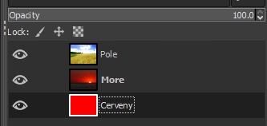

# 20. Bitmapový grafický editor

***Obsah otázky:*** Vrstvy a operace s vrstvami, klonovací razítko, filtry a práce s filtry, úprava fotografií (úrovně, jas, kontrast, barevné režimy, barevné modely), práce s textem 

- AKA rastrový grafický editor
- program umožňující pomocí GUI vytvářet a upravovat soubory s rastrovou grafikou
- obrázek je popsán pomocí jednotlivých barevných bodů - pixelů, narozdíl od vektorové grafiky, která je popsána křivkami
	- změna velikosti (zvětšování nebo zmenšování) vede ke zhoršení obrazové kvality obrázku, zejména zvětšování obrázku je možné jen v omezené míře, neboť při větším zvětšení je na výsledném obrázku patrný rastr
	- poměrně velké nároky na paměťové zdroje (při vysokém rozlišení a barevné hloubce velikost obrázku dosahuje i jednotek megabytů, v profesionální grafice se běžně operuje i s podklady o desítkách megabytů)
- příklady:
	- GIMP - free a open source editor rastrové grafiky od projektu GNU
	- Krita - FOSS editor rastrové grafiky mířený spíše na digitální kreslení od projektu KDE
	- Adobe Photoshop - placený editor s pokročilými funkcemi
	- Photopea - editor zdarma, který funguje bez instalace jen v prohlížeči

## Vrstvy
- umožňují nezávisle pracovat s více obrázky
- nahoře vidíme nejvyšší vrstvu, pod ní tu další atd...
- možnost úpravy průhlednosti:  

- pokud vložíme obrázek, je umístěn do plovoucí vrstvy, kterou musíme ukotvit do vrstvy pod ní nebo převést na novou vrstvu (right click)
- všechno ostatní, co by člověk potřeboval udělat, je v right clicku

## Klonovací razítko
- umožňuje klonovat kus obrázku někam jinam
- např. odstranění objektu z fotografie tím, že jej překryjeme jinou částí fotky
- Ctrl + left click - nastavení zdroje, ze kterého klonujeme

## Filtry
- transformují nějakým způsobem obrázek (či výběr v obrázku)
- např. oillify (olejomalba), rozostření...
- jas, kontrast, teplota barev