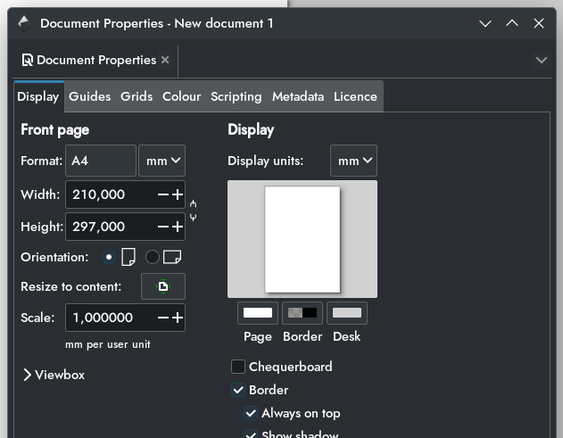

# 21. Vektorový grafický editor

***Obsah otázky:*** prostředí programu, nastavení kreslící plochy, práce s textem, úpravy objektů, vrstvy

## Vektorová grafika
- grafika vyjádřená pomocí bodů, přímek, křivek a mnohoúhelníků namísto pixelů - **škálovatelné** na jakoukoliv velikost
- použití pro loga, ikony
- nevhodné pro ukládání fotografií reálného světa
- formáty:
	- SVG (scalable vector graphics) - nejpoužívanější formát, založený na XML, nativně ho podporují prohlížeče
	- PS / EPS ((encapsulated) PostScript) - programovací jazyk určený ke grafickému popisu tisknutelných dokumentů, vyvinut Adobe, nahrazen PDF
	- AI - proprietární formát od Adobe
- editory: **Inkscape** (zbytek otázky), Adobe Illustrator (AI), CorelDraw

## Nastavení kreslící plochy
- File -> Document properties (Soubor -> Vlastnosti dokumentu)  
	
	- Nastavení velikosti stránky, jednotek...
	- Metadata (Autor dokumentu, licence...)
- na plochu můžeme přidávat vodítka tažením z pravítka na okraji obrazovky
	- dvojklikem na vodítko můžeme přesně nastavit umístění, rotaci, nebo vodítko odebrat
	- Edit -> Delete all guides odstraní všechna vodítka

## Práce s objekty
- vlevo můžeme vytvořit kruh, elipsu, obdélník, hvězdu, n-úhelník...
	- tímto se vytvoří objekt - nahoře přes Path -> Object to path (Cesta -> Objekt na cestu) můžeme převést na generickou křivku, jejíž body můžeme upravovat
- objekty můžou přiléhat k vodítkům a jiným objektům zapnutím snappingu vpravo (v novějších verzích vpravo nahoře) 

## Práce s textem
- vlevo můžeme přidat text a psát
- nahoře můžeme nastavit písmo, velikost písma
- v nabídce Text -> Put on path můžeme text umístit na nějakou křivku, ve stejné nabídce lze i odebrat
- i text můžeme převést na generickou křivku podle postupu v předchozí sekci
	- tímto nemusí ten, kdo si SVG prohlíží, mít font který jsme použili (ve výchozím stavu se text ukládá jako text, křivku sice nemůžeme bez OCR vrátit zpět na text, ale je zachován tvar jednotlivých písmen)
- v nabídce Text -> Flow into frame můžeme vynutit text, aby se zalamoval podle nějakého objektu

# Práce s vrstvami
- Ctrl+Shift+L otevře nabídku vrstev
- Vrstvy lze pojmenovávat, přesouvat a zamykat pro snadnější organizaci objektů
- I objekty lze pojmenovávat
