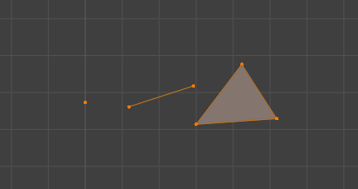
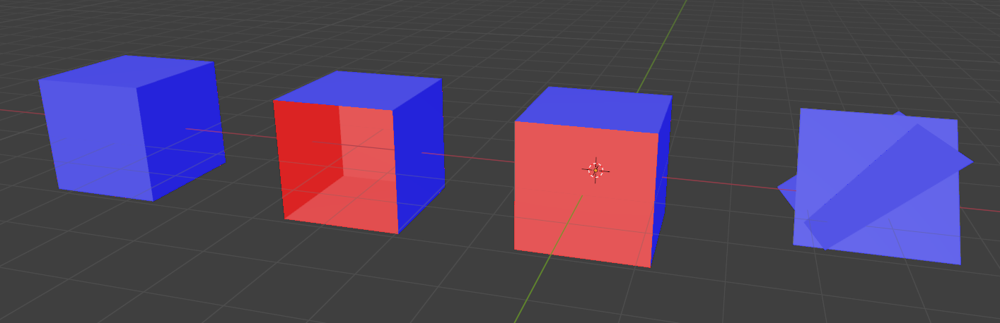

# 22. Práce s prostorem

***Obsah otázky:*** 3D modelování a 3D tisk; principy a používané technologie

## Modelování
- **CAD** (Computer Aided Design) - software používaný pro tvorbu 3D modelů (objektů)
    * Autodesk TinkerCAD - velmi jednoduchý CAD software pro tvorbu modelů, běží v prohlížeči
    * OpenSCAD - open source CAD SW, který vytvýří předměty na základě skriptu (ve vlastním p. jazyce)
    * Blender - open source program pro 3D tvorbu obecně, použití spíše pro rendery
- Model se skládá z:
    * Vrcholů (vertex/vertices) - Body v 3D prostoru
    * Hran (edge/s) - Propojení dvou vrcholů
    * Stran (face/s) - Propojení několika hran v stranu  

- Modely ukládáme nejčastěji do souboru .STL (standard triangle language), který je univerzální a nejpoužívanější
    * při uložení dojde k triangulaci modelu - strany jsou rozděleny na trojúhelníky
    * další formáty: .DAE (Collada, založený na XML), .OBJ, .FBX
- Požadavky na 3D model k tisku:
    * Model musí být tzv. manifoldní, tedy být uzavřeným objektem, který by šlo teoreticky rozložit jako papír (představte si to jako "kříž" který vznikne, když rozložíte krychli)  
    * Nesmí se překřižovat strany  
      
    * Příklady chybných modelů. Zleva doprava: Model bez chyb; model s chybějící stranou; model, jehož strany mají odlišné normály; překřižující se strany

## Tisk
- Laické tiskárny tisknou především z plastů:
    - PLA (PolyLactic Acid) - netoxický, biologicky odbouratelný plast vhodný pro dekorace, hračky aj. předměty, tisk při ~200˚C
    - PETG (PolyEthylene Terephthalate Glycol) - pevnější plast s podobnými vlastnostmi jako PLA, tisk při ~240˚C
    - ABS (Acrylonitrile Butadiene Styrene) - jeden z prvních plastů, lepší vlastnosti než PLA, ale toxický (zapáchá při tisku a musí se ventilovat), tisk při ~230˚C
- Profesionální tiskárny třeba i různé kovy (hliník, měď, ocel, titan), beton, sklo
- Typy 3D tiskáren
    - a) **Aditivní** - materiál je přidáván, nanášen
    - b) **Subtraktivní** - materiál je ubírán, vrtán
- Dělení podle nanášení materiálu:
    - **FDM - Fused deposition modeling** - hlavice cestuje po desce a vytláčí roztavený plast, nejčastější
    - SLS - Selective Laser Sintering - spékání materiálu UV zářením
    - Stereolitografie - tvrzení fotopolymeru UV zářením, jedna z prvních technologií 3D tisku (patent Chuck Hull 1986)
    - 3DCP - práškový materiál a tekutý spojovač (patent MIT 1993)
- Tiskárna nerozumí 3D modelům, model musí "předžvýkat" tzv. **Slicer**
    - program, který umí model načíst a převést ho na formát pro 3D tiskárny
    - rozdělí model na jednotlivé vrstvy, které tiskárna vytváří
    - **Podpory** - Model je tisknut zespoda vzhůru a materiál nemůže jen tak "viset" - Slier musí vygenerovat podpůrné struktury, které po vytisknutí odstraní člověk
    - příklady: Ultimaker Cura, PrusaSlicer
- Důležitá nastavení při 3D tisku:
    - Teplota plastu při tisku, teplota podložky, na kterou je plast nanášen
    - Rychlost pohybu
    - Poměr vyplňování (šetření materiálu tím, že vnitřek předmětu není 100% vyplněn plastem)
- V České republice - **Prusa Research**
    - firma vývojáře Josefa Průši
    - 2. největší výrobce domácích 3D tiskáren na světě
    - jejich tiskárny jsou open source hardware