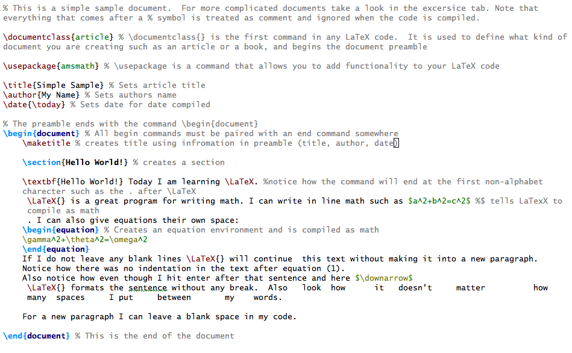

# 24. Typografický systém TeX

***Obsah otázky:*** základní struktura dokumentu, sazba hladkého textu, sazba matematických textů, odkazy, poznámky pod čarou, tvorba obsahu

## Pojmy: 
- textový editor: pracuje pouze s plaintextem / prostým textem, v textových souborech jsou ukládané znaky pouze znaky v nějakém kódování
- textový procesor: pro tvoření bohatě formátovaného textu, do souborů je krom textu uložena i informace o veškerém formátování
- DTP systém (systém pro sazbu textu): DTP zkratka pro *Desktop publishing*; profesiální počítačová sazba textu a jiných grafických elementů a příprava výsledné grafické předlohy ve formátu vhondém pro tisk
- původně DTP poskytovalo více kontroly nad designem, rozvržením a typografií než text. procesory, ale postupem času se textové procesory evolvovaly do bodu, kdy dnes poskytují většinu možností dříve dostupých jen v DTP

- typografie: disciplína zabývající se písmem, především jeho správným výběrem, použitím a sazbou.

## Co je TeX
- TeX je program pro počítačovou sazbu / typografický systém určený pro sazbu dokumentů technického zaměření s větším obsahem matematických výrazů
- vytvořil jej Donald Ervin Knuth v 70. letech, byl nespokojen se způsobem, jakým byly sázeny jeho knihy
- jeho záměrem bylo vytvořit nástroj pro naprosto přesný popis rozvržení textu pro sazbu odborné literatury v profesionální kvalitě
- autor Donald E. Knuth o něm říká: „Je to nástroj určený pro tvorbu hezkých knih – a obzvlášt knih obsahujících spoustu matematiky"
- nabízí uživatelům mocné programovací schopnosti, které umožňují proces sazby výrazně ovlivňovat
- nevhodný nástroj pro malé dokumenty (letáky, vzkazy apod.)

## Co je LaTeX
- sada maker nad systémem TeX
- vytvořil jej Leslie Lamport
- umožňuje snadnou sazbu odborných článků, knih apod. definováním nových příkazů (maker)
- pomocí tohoto systému může i uživatel bez znalostí sazby či programování využívat rozsáhlých výhod nabízených programem TeX a za krátký čas vytvořit rozmanité textové výstupy v knižní kvalitě (práce v samotném TeXu je obtížná..)  

### Základní struktura zdrojového kódu v LaTeXu
- LaTeX je značkovací jazyk -> používá značky/příkazy pro popsání textového obsahu a rozvržení dokumentu
- zdrojvý kód (textový soubor .tex) se pak přeloží pomocí překladače TeXu (PdfTeX, pdfLaTeX, XeLaTeX, ...) na soubor požadováného typu (např. pdf, dvi, ps)
- všechny příkazy začínají znakem \\ (zpětné lomítko), za nímž následuje jméno příkazu, 
- nepovinné parametry příkazu se píší do hranatých závorek, povinné do složených; např. \usepackage[czech]{babel}
- znak procento % zahajuje komentář
- každý LaTeX dokument musí obsahovat *hlavičku* (někdy též *preambuli*) a *tělo*
- *hlavička* je sekvence příkazů, které specifikují globálních parametry pro zpracování textu (např.: formát papíru, výška a šířka textu, vzhled výstupní stránky,...), případně jméno autora, titulek, ...
- první příkaz hlavičky bývá \documentclass{typ dokumentu}, následují \usepackage{balíček} na import balíčků doplňujících funkcí
- *tělo* dokumentu je označeno příkazy \begin{document} a \end{document}, mezi nimi je uveden veškerý obsah dokumentu, který může být dále formátován příkazy
- příkazy \section{název sekce} tvoří nadpisy kapitol

### Sazba hladkého textu
- samotný obsah odstavců se pouze vepisuje do *těla* bez dalších příkazů
- ve zdroji nezáleží na počtu mezer mezi slovy
- nový řádek ve zdrojovém kódu odděluje dva odstavce
- do textu lze přidávat různé příkazy, např \textbf{Tučný text}
- nezlomitelná mezera znakem ~

### Sazba matematických textů
- matematický text lze do normálního textu vložit dvěma způsoby:
	- začleněním do řádku pomocí ohraničení matematického textu symboly dolarů, např.: Tato rovnice \$ x + 1 = 10 \$ není těžká.
	- umístěním na samostatný řádek zarovaný na střed pomocí ohraničení dvojitými dolary (\$\$ x = 1 \$\$)
- horní a dolní indexy pomocí ^ a _
- zlomek: \frac{čitatel}{jmenovatel}
- odmocniny: \sqtr[]{arg}
- a další přikazy pro další symboly (limity, sumy, ale i třeba řecká písmena)

### Odkazy
- prvek si nejprve označíme příkazem \label{název labelu}, např.: \section{Úvod} \label{intro}
- na něj se pak můžeme odkazovat dále v textu pomocí \ref{název labelu}
- \pageref{název labelu} vloží číslo stránky s labelem

### Poznámky pod čarou
- \footnote{Poznámka pod čarou}
- užívají se většinou k uvedení doplňujícího komentáře

### Tvorba obsahu
- \tableofcontents vytvoří obsah - tj. seznam všech nadpisů vytvořených příkazy \chapter, \section, \subsection a dalšími s odpovídajícími čísly stran
