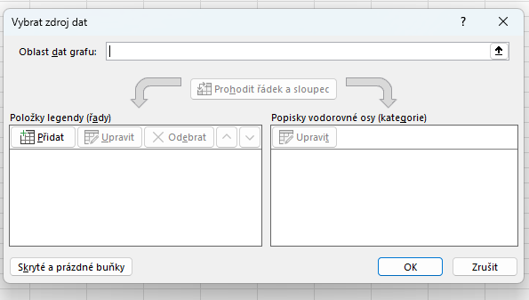

# 25. Tabulkové kalkulátory

***Obsah otázky:*** prostředí programu, výběr buněk, formát buňky, automatický formát tabulky, podmíněné formátování, vzorce a funkce, absolutní a relativní adresování, tvorba grafů, filtry a řazení dat, funkce data a času, zamknutí listu, funkce najít a nahradit

## Tabulkový kalkulátor
- program určený pro zpracování textových a numerických dat (statistika, vizualizace, výpočet)
- hlavně pro **účetnictví**, **ekonomii**, **vědu**
- jeden z prvních typů programů, co vznikl pro stolní počítače
- formáty: xls, xlsx (založený na zazipovaných xml souborech), ods

## Práce v programu Excel
- soubory nazýváme "sešity", 1 soubor = 1 sešit
- možnost přidávat listy ("záložky") - lišta dole
- buňky
    - sloupce písmenka, řádky číslice
    - buňky můžou být různých datových typů (datum, číslo, měna) a formátování (symbol měny, mezery v čísle, počet desetinných míst)
    - možnost použít funkce (`=NÁZEVFUNKCE()`) pro dynamickou práci s daty
    - reference na bunky pomocí jejich adres
        - adresace pomocí písmene (sloupec) a čísla (řádky)
        - můžeme před buď písmeno, nebo číslo, nebo obojí (též zkratka F4) napsat $ a udělat z ní absolutní adresu (nemění se při "rozšiřování" dat dole v pravém rohu)§

### Některé funkce
- `RANDBETWEEN()` - náhodné číslo
- `SUMA()` - sečíst hodnoty v rozsahu buněk
- `MIN()`, `MAX()` - nejmenší/nejvyšší hodnota v rozsahu
- `PRŮMĚR()` - aritmetický průměr hodnot v rozsahu
    - Pokud je výsledek periodické číslo (např. 26,666667), je vhodné buňku označit a v nabídce formát buněk omezit počet desetinných míst
- `RANK()` - určí pořadí buňky v širší oblasti - "žebříček" hodnot, kde 1 je nejvyšší
    - pozor, `RANK()` je legacy funkce - v moderním excelu použít `RANK.EQ()`

### Tvorba grafu
- Graf přidáme ve Vložení -> Grafy
- Data (vlevo) a popisky (vpravo) přidáme praým kliknutím v množnosti přidat data

- při dvojkliku na graf se vpravo objeví nabídka formátování - můžeme upravit vzhled grafu

### Ochrana proti úpravám
- V záložce revize lze zamnkout list či celý sešit
- Lze **přidat výjimky**